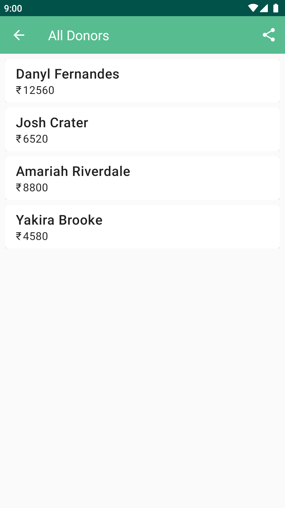

# Offered 

  

  

* An Android application that helps me jot and calculate the donations I collect at my local church
* It focuses on the calculation of donations and seperates viewing of donors

# What's Different

* Written purely in Kotlin.
* Built on MVP architecture to facilitate separation of business logic & testability.
* Using Material Theme Components.
* Mockito for testing the Presenters.

# Screenshots

  
  

# Download 

<a href="https://github.com/gitryder/Offered/raw/master/app/release/app-release.apk">Click here to download!</a>

